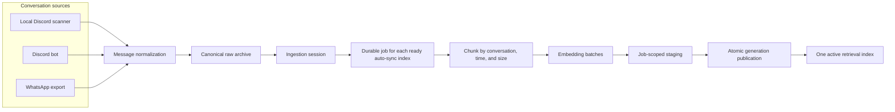
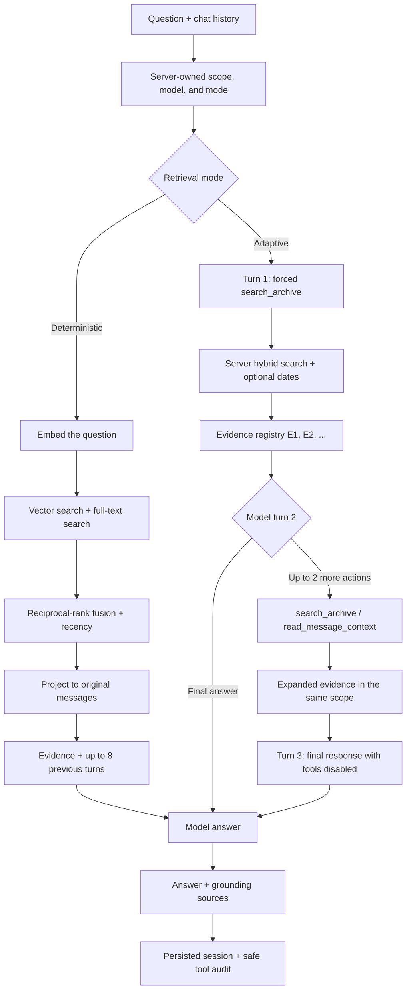

<div align="center">
  
  <h1>Chat Context</h1>
  <p>A self-hosted web and desktop application for archiving conversations and answering questions with traceable grounding in their content.</p>
  <p>
    <a href="README.md">České README</a> ·
    <a href="docs/architecture.md">Documentation</a> ·
    <a href="docs/api.md">Public API</a>
  </p>
</div>

## Screenshot

### Grounded chat

The chat shows an answer together with archive steps and the traceable messages that support it.


### Database overview

The database overview brings together archive status, indexing quality, time range, conversations, authors, embedding models, and stored chunks.


## About

Chat Context unifies Discord and WhatsApp conversations in a canonical archive that preserves source, conversation, and author identity. It can manage multiple independent embedding indexes over the same data and expose the archive through a local Electron application, a remote Electron client, or a secured web interface.

The project separates message collection from indexing. It prepares new vectors in staging tables and publishes them atomically only after the complete job succeeds. Answers remain traceable to original messages through hybrid full-text and vector retrieval in either deterministic mode or a server-bounded adaptive mode.

## Key features

- Import history through the local Discord scanner in Electron.
- Continuously synchronize channels and answer questions through the optional Discord bot.
- Import WhatsApp exports in `.txt` or `.zip` format.
- Normalize and deduplicate messages in one source-neutral archive.
- Manage multiple independent embedding indexes over the same data.
- Search every stored message or one selected conversation while keeping the scope fixed for the entire chat session.
- Persist chats together with their model, retrieval mode, grounding sources, and safe archive-tool audit.
- Show original messages, exact chunk context, and neighboring messages loaded by adaptive retrieval.
- Use OpenAI or custom OpenAI-compatible providers through the Responses or Chat Completions protocol.

## How it works

### 1. Ingestion and indexing



Every connector writes into the same normalized archive. The indexing worker processes a closed session outside the ingestion path and keeps the current searchable index available until the new generation is complete.

### 2. Question, retrieval, and answer



Deterministic mode performs one hybrid retrieval pass. Adaptive mode lets the model refine its archive query and load bounded context around an already discovered message, but it cannot change source scope or exceed server limits. The complete contract is documented in [Chat retrieval and archive tools](docs/chat-retrieval.md).

## Architecture

- One framework-free renderer serves Electron Local, Electron Remote, and the authenticated web runtime.
- Electron Local coordinates the local Discord scanner, PostgreSQL in Docker, and the FastAPI backend; Electron Remote uses a remote server without direct database access.
- The Node.js web gateway serves the renderer, handles authentication, exposes an authorized API facade, and streams NDJSON or SSE events.
- FastAPI owns ingestion, indexing jobs, retrieval, chats, settings, and the public workspace contract.
- PostgreSQL 16 with pgvector stores canonical messages, job state, persistent read models, chats, and published embedding generations.
- OpenAI and OpenAI-compatible providers supply embeddings and answer generation behind server-enforced boundaries.

The complete overview of runtime modes, data flows, and extension boundaries is documented in [Architecture](docs/architecture.md).

## Technology stack

| Layer | Technology |
| --- | --- |
| Interface | Electron 43, framework-free HTML, CSS, and JavaScript, shared web renderer |
| Web gateway | Node.js 24, authenticated HTTP API, NDJSON, and SSE |
| Backend | Python 3.12, FastAPI, Pydantic, Uvicorn |
| Data | PostgreSQL 16, pgvector `halfvec`, HNSW, PostgreSQL full-text search |
| AI | OpenAI and OpenAI-compatible Responses / Chat Completions providers |
| Quality | `node:test`, pytest, pip-audit, PostgreSQL integration tests |
| Operations | Docker Compose, Electron Local / Remote, Linux web profile |

## Local setup

The local Electron workspace requires Node.js 24+, Python 3.12 through the Windows `py` launcher, and Docker Desktop.

```powershell
npm.cmd install
py -3.12 -m pip install -r backend/requirements-dev.txt
Copy-Item .env.example .env
npm.cmd run --silent web:secrets
```

Copy the generated values into `.env` and set `OPENAI_API_KEY`, or configure a compatible provider in the application later. Then start the application:

```powershell
.\run.bat
```

The Linux web profile, HTTPS reverse proxy, backups, and remote Electron workspace are covered by [Setup and operation](docs/setup.md).

## Tests and quality

The standard test suites do not use paid AI requests:

```powershell
npm.cmd test
npm.cmd run test:python
```

Audit Python dependencies:

```powershell
npm.cmd run audit:python
```

The atomic-publication, persistent read-model, and other database contract tests require a dedicated empty PostgreSQL database. The commands and `POSTGRES_TEST_DSN` variable are documented under [Verification](docs/setup.md#verification).

## Documentation

The `docs/` directory is the canonical source of documentation for current behavior:

- [Architecture](docs/architecture.md)
- [Setup and operation](docs/setup.md)
- [Public API](docs/api.md)
- [Chat retrieval and archive tools](docs/chat-retrieval.md)
- [Desktop operation](docs/desktop-operation.md)
- [Discord bot](docs/discord-bot.md)
- [Models, providers, and embedding indexes](docs/model-settings.md)
- [Renderer shell](docs/renderer-shell.md)
- [Persistent UI read model](docs/ui-read-model.md)
