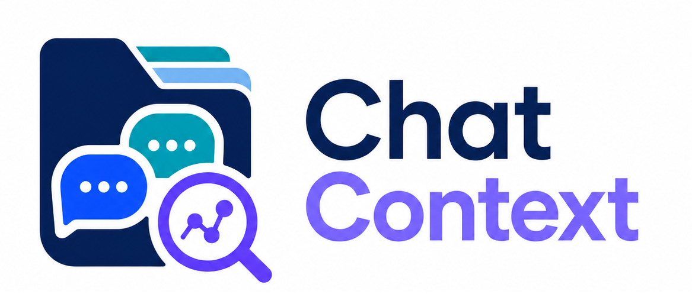
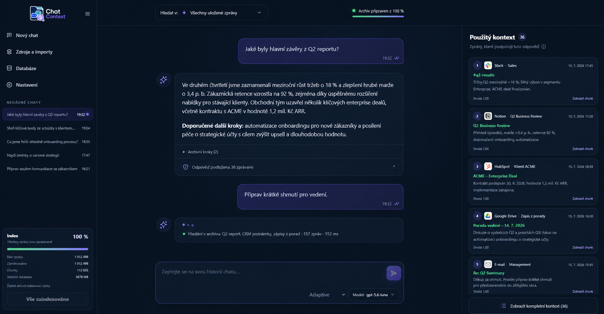
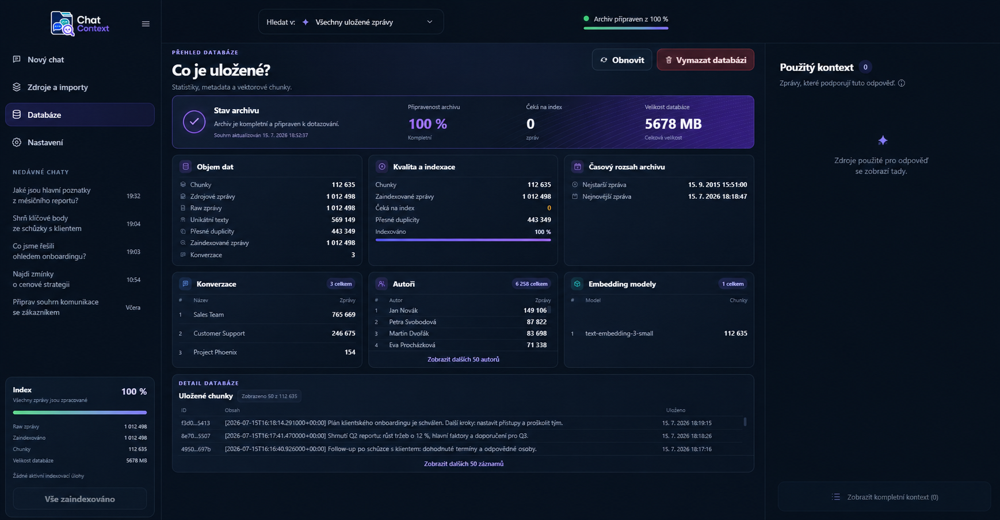
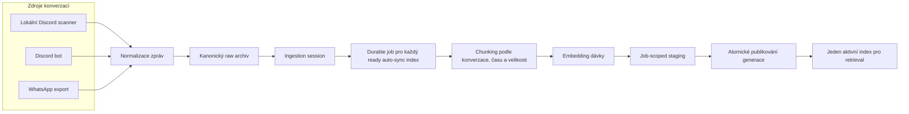
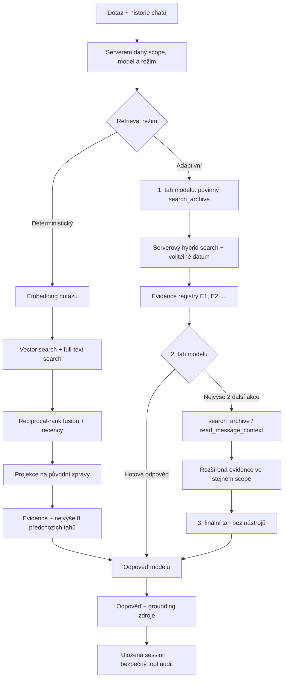

<p align="center">
  
</p>

# Chat Context

Self-hosted webová a desktopová aplikace pro archivaci konverzací a zdrojově podložené odpovědi nad jejich obsahem.

[English README](README.en.md) · [Dokumentace](docs/architecture.md) · [Veřejné API](docs/api.md)

## Screenshot

### Chat se zdroji

Chat zobrazuje odpověď společně s archivními kroky a dohledatelnými zprávami, o které se odpověď opírá.



### Přehled databáze

Databázový přehled spojuje stav archivu, kvalitu indexace, časový rozsah, konverzace, autory, embedding modely a uložené chunky.



## O projektu

Chat Context sjednocuje konverzace z Discordu a WhatsAppu do kanonického archivu, který zachovává identitu zdrojů, konverzací i autorů. Nad stejnými daty dokáže spravovat několik nezávislých embedding indexů a zpřístupnit archiv přes lokální Electron aplikaci, vzdáleného Electron klienta nebo zabezpečený web.

Projekt odděluje sběr zpráv od indexování. Nové vektory připravuje ve staging tabulkách a publikuje je atomicky až po dokončení celé úlohy. Odpovědi kombinuje s dohledatelnými původními zprávami pomocí hybridního full-textového a vektorového vyhledávání, a to v deterministickém nebo serverem omezeném adaptivním režimu.

## Hlavní funkce

- Import historie pomocí lokálního Discord scanneru v Electronu.
- Průběžná synchronizace kanálů a odpovídání přes volitelného Discord bota.
- Import WhatsApp exportů ve formátu `.txt` nebo `.zip`.
- Normalizace a deduplikace zpráv v jednom zdrojově neutrálním archivu.
- Více nezávislých embedding indexů nad stejnými daty.
- Vyhledávání ve všech zprávách nebo ve vybrané konverzaci s pevným rozsahem po celou chatovací session.
- Ukládání chatů včetně modelu, režimu retrievalu, zdrojů a bezpečného auditu archivních nástrojů.
- Zobrazení původních zpráv, přesného chunk contextu a sousedních zpráv načtených adaptivním režimem.
- Podpora OpenAI a vlastních OpenAI-compatible providerů přes Responses nebo Chat Completions protokol.

## Jak projekt funguje

### 1. Ingest a indexování



Každý konektor zapisuje do stejného normalizovaného archivu. Indexační worker zpracuje uzavřenou session mimo ingest cestu a současný prohledávatelný index ponechá dostupný, dokud není nová generace kompletní.

### 2. Dotaz, retrieval a odpověď



Deterministický režim provede jeden hybridní retrieval. Adaptivní režim dovolí modelu upřesnit archivní dotaz a načíst omezené okolí již nalezené zprávy, ale nemůže změnit zdrojový scope ani překročit serverové limity. Podrobný kontrakt popisuje dokument [Chat retrieval and archive tools](docs/chat-retrieval.md).

## Architektura

- Jeden framework-free renderer obsluhuje Electron Local, Electron Remote i autentizovaný webový runtime.
- Electron Local koordinuje lokální Discord scanner, PostgreSQL v Dockeru a FastAPI backend; Electron Remote používá vzdálený server bez přímého přístupu do jeho databáze.
- Node.js web gateway poskytuje renderer, autentizaci, autorizovaný API facade a živé NDJSON nebo SSE události.
- FastAPI vlastní ingest, indexační úlohy, retrieval, chaty, nastavení a veřejný workspace kontrakt.
- PostgreSQL 16 s pgvector ukládá kanonické zprávy, stav úloh, persistentní read modely, chaty a publikované embedding generace.
- OpenAI a OpenAI-compatible provideři zajišťují embeddingy a generování odpovědí za serverem řízenými hranicemi.

Kompletní přehled runtime režimů, datových toků a extension boundaries je v dokumentu [Architektura](docs/architecture.md).

## Použité technologie

| Vrstva | Technologie |
| --- | --- |
| Rozhraní | Electron 43, framework-free HTML, CSS a JavaScript, sdílený webový renderer |
| Web gateway | Node.js 24, autentizované HTTP API, NDJSON a SSE |
| Backend | Python 3.12, FastAPI, Pydantic, Uvicorn |
| Data | PostgreSQL 16, pgvector `halfvec`, HNSW, PostgreSQL full-text search |
| AI | OpenAI a OpenAI-compatible Responses / Chat Completions provideři |
| Kvalita | `node:test`, pytest, pip-audit, integrační testy PostgreSQL |
| Provoz | Docker Compose, Electron Local / Remote, Linux web profil |

## Lokální spuštění

Lokální Electron workspace vyžaduje Node.js 24+, Python 3.12 přes Windows `py` launcher a Docker Desktop.

```powershell
npm.cmd install
py -3.12 -m pip install -r backend/requirements-dev.txt
Copy-Item .env.example .env
npm.cmd run --silent web:secrets
```

Vygenerované hodnoty zkopírujte do `.env` a nastavte `OPENAI_API_KEY`, případně později nakonfigurujte kompatibilního providera v aplikaci. Aplikaci potom spusťte:

```powershell
.\run.bat
```

Linux web profil, HTTPS reverse proxy, zálohování a vzdálený Electron workspace popisuje dokument [Instalace a provoz](docs/setup.md).

## Testy a kontrola kvality

Standardní testy nepoužívají placené AI požadavky:

```powershell
npm.cmd test
npm.cmd run test:python
```

Audit Python závislostí:

```powershell
npm.cmd run audit:python
```

Testy atomického publikování, persistentních read modelů a dalších databázových kontraktů vyžadují samostatnou prázdnou PostgreSQL databázi. Příkazy a proměnnou `POSTGRES_TEST_DSN` uvádí sekce [Verification](docs/setup.md#verification).

## Dokumentace

Složka `docs/` je kanonickým zdrojem dokumentace aktuálního chování:

- [Architektura](docs/architecture.md)
- [Instalace a provoz](docs/setup.md)
- [Veřejné API](docs/api.md)
- [Chat retrieval a archivní nástroje](docs/chat-retrieval.md)
- [Desktopové ovládání](docs/desktop-operation.md)
- [Discord bot](docs/discord-bot.md)
- [Modely, provideři a embedding indexy](docs/model-settings.md)
- [Renderer shell](docs/renderer-shell.md)
- [Persistentní UI read model](docs/ui-read-model.md)
